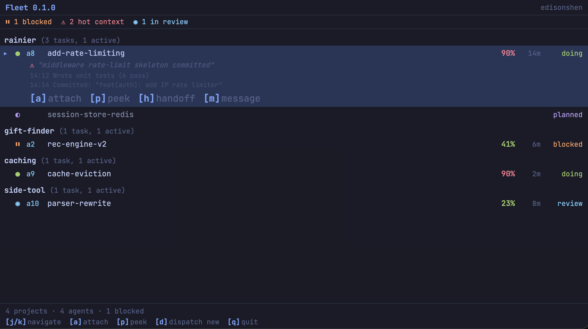

# Fleet

> Everyone is a manager.

Running many Claude Code sessions across many repos turns you into a
human scheduler: which tab is blocked, whose context is hot, which PR
needs a rebase. Fleet collapses that surface into one TUI. A per-project
coordinator owns the task list and dispatches workers; every worker
runs in its own git worktree on its own branch; context handoffs happen
automatically with the prior session's state attached. You stay the
manager. The agents do the work.



## Why Fleet

- **50% context handoff, with context.** `fleet-guard` watches every
  agent's context usage and triggers a handoff at 50% / 70% thresholds.
  The successor receives a structured doc carrying prior state,
  decisions made, files modified, and next steps. You don't babysit
  context.
- **One coordinator per project.** Each project gets a dedicated coord
  session that owns `tasks.md`, dispatches workers, and shepherds PRs.
  Your single point of contact per repo.
- **Coord designs and splits the work.** Describe a problem, the coord
  runs a planning conversation (scope, edge cases, testing plan), then
  splits it into tasks and dispatches workers — only after you approve.
  No surprise scope.
- **Tasks run in parallel.** Above parallelism 1, every worker runs in
  its own git worktree on its own branch. Multiple PRs open at once,
  all independently progressing.
- **Per-task status tracking.** `tasks.md` is the source of truth —
  status, priority, lifecycle timestamps, PR URL, notes. Visible in the
  TUI, mutable via `fleet tasks`.
- **Workers learn as they work.** Each project keeps a `learnings.md`
  log that workers append to as they hit gotchas, fixes, or domain
  conventions. The coordinator injects the top recent learnings into
  every subsequent dispatch prompt — so the next worker inherits prior
  workers' hard-won lessons without operator re-onboarding. Project
  intelligence compounds.
- **PR autopilot.** Each worker watches its own PR. CI fails →
  retry-fix subagent. PR goes BEHIND or DIRTY → rebase subagent on an
  isolated worktree. Trivial review comments addressed inline.
  Substantive Go conflicts raise to the operator.
- **Remote control.** Mobile claude.ai can pair with running coord and
  worker sessions via the bundled remote-control daemon. Shepherd work
  from your phone.
- **Clear install.** Brew tap, one runtime dep (`tmux`), one external
  CLI (`claude`), one bootstrap step (`fleet init`). No hidden config.

## Install

```sh
brew install edisonshen/tap/fleet
```

From source (Go 1.25+):

```sh
go install github.com/edisonshen/fleet/cmd/fleet@latest
```

Then bootstrap once:

```sh
fleet init
```

`fleet init` installs the bundled `fleet-guard` and `coordinator`
skills under `~/.claude/skills/` and seeds `~/.fleet/standards.md`.

### Skill install shape: copy vs symlink

A bundled skill can sit on disk two ways:

| Shape     | Source              | When a merged skill fix goes live                 | Best for                     |
|-----------|---------------------|---------------------------------------------------|------------------------------|
| **copy**  | embedded binary bytes | after rebuilding the binary **and** re-running `fleet skills sync` | brew / binary-only installs  |
| **symlink** | the repo checkout's `skills/<name>/` | immediately, on the next coord spawn              | developing **on** Fleet      |

`fleet init` and `fleet skills sync` install **copies** — self-contained,
the only safe option when there is no repo checkout (brew). The cost: a
merged skill fix is invisible to a running coord until you rebuild the
binary and re-`sync`. This gap once silently neutered a merged P0
(`#182`): the install was a frozen hand-copied snapshot, so the fix never
reached the running coord.

If you are **developing on Fleet** (you have the repo checked out), use a
symlink so fixes go live the moment they land in your checkout:

```sh
fleet skills link            # symlink ~/.claude/skills/<name> -> <repo>/skills/<name>
                             # (auto-detects the checkout from registered projects)
fleet skills link --from ~/projects/fleet   # or point at a checkout explicitly
```

**Recommendation:** symlink for anyone working on the Fleet repo itself
(this is the default for the maintainer); copy for everyone else.

**Symlink tradeoff:** the linked skill follows your checkout's working
tree. If the checkout sits on a feature branch, the coord runs that
branch's skill code. Keep the linked checkout on `main` for stable
behavior, or `fleet skills sync --force` to convert back to a pinned copy.

`fleet skills status` reports each skill's shape and **flags a copy that
has diverged from the repo** (a merged fix the running coord can't see),
exiting non-zero so CI/scripts catch the drift. A coord also warns to
stderr at startup if its skill dir is a stale copy.

Runtime deps: `tmux` (brew pulls it transitively) and the
[Claude Code](https://docs.anthropic.com/en/docs/claude-code) CLI.

> The brew tap path matters on upgrade: a JetBrains IDE is also
> distributed as a cask named `fleet`, so `brew upgrade fleet`
> resolves to the cask. Always upgrade by tap:
> `brew upgrade edisonshen/tap/fleet`.

## Quickstart

```sh
fleet init                              # one-time: install skills + seed standards
cd ~/projects/myrepo
fleet                                   # open the dashboard
```

From the dashboard:

1. Press `[+]` to register the current repo (or any cloned repo) as a
   Fleet project.
2. Move the cursor to the project row and press `[a]` to spawn its
   coordinator.
3. In the coord's tmux session, describe a problem in plain English.
   The coord runs DISCUSS → PLAN-DOC → SPLIT → TASK LIST →
   TASK-PLAN-DOC with you.
4. Approve the plan. The coord saves the approved implementation plan
   under the project's `docs/` folder, writes `tasks.md`, saves
   per-task plan docs, then starts the worker/reviewer/finisher flow on
   its next tick.
5. Watch progress in the dashboard. Press `[a]` on a worker row to
   peek at its heartbeat; press `[h]` to force a handoff if context
   is hot.

## Hotkeys

| Key       | Action                                                |
|-----------|-------------------------------------------------------|
| `j` / `k` | Move cursor (wraps)                                   |
| `enter`   | Expand/collapse row, or open detail                   |
| `a`       | Attach: coord (project), tmux (agent), peek (worker)  |
| `d`       | Dispatch a new agent (opens repo picker)              |
| `+`       | Register a cloned repo as a fleet project             |
| `h`       | Handoff the selected agent to a fresh replacement     |
| `x`       | Archive the selected agent                            |
| `/`       | Filter dashboard rows by substring                    |
| `?`       | Help                                                  |
| `q`       | Quit                                                  |

Full surface: `fleet --help`.

## Architecture

A **project** is a repo Fleet has seen. A **coordinator** is a
per-project Claude Code session that owns `tasks.md` (one coord per
project, NB-flocked). A **worker** is a Claude Code agent in a detached
tmux session running one task in its own worktree. A **handoff** fires
when an agent's context % gets hot — `fleet-guard` writes a structured
doc and a fresh agent picks the work up.

See [docs/DESIGN.md](docs/DESIGN.md) for the design rationale and
[docs/COORDINATOR-WORKFLOW.md](docs/COORDINATOR-WORKFLOW.md) for the
eight-step engagement flow (DISCUSS → PLAN-DOC → SPLIT → TASK LIST →
TASK-PLAN-DOC → IMPLEMENT → PR-TRACK → DONE).

## More

- `fleet --help` — full CLI surface (`dispatch`, `attach`, `handoff`,
  `drain`, `tasks`, `workers`, `learnings`, `standards`, `peek`,
  `maintenance`).
- [CHANGELOG.md](CHANGELOG.md) — release history.
- [skills/fleet-guard/SKILL.md](skills/fleet-guard/SKILL.md) — agent-side
  context watcher and handoff trigger.
- [skills/coordinator/SKILL.md](skills/coordinator/SKILL.md) — per-project
  autonomous task driver.

## License

MIT — see [LICENSE](LICENSE).
